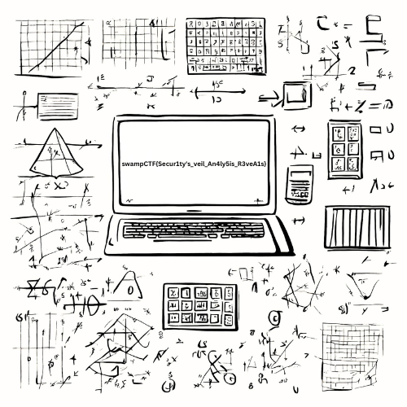

# Intended Solution to More Than Meets The Eye

This challenge requires some research in order to identify the potential algorithms that could have been used to obfuscate the referenced image. This line of the prompt gives you the crucial clue:

`I'll even give you a hint, you may want to look into the work done by Carl Friedrich Gauss when calculating orbits.`

Performing a search for Carl Friedrich Gauss will bring up the Wikipedia page for him as one of the first results, and at the time of the CTF a portion of the page under 'Numerical Analysis' stated:

`Gauss invented an algorithm for calculating what are now called discrete Fourier transforms, when calculating the orbits of Pallas and Juno in 1805, 160 years before Cooley and Tukey found their similar Cooley–Tukey FFT algorithm...`

The FFT algorithm is typically associated with signal data, but has been utilized to perform some operations (like high and low pass filtering) on image data. Furthermore, the algorithm results in data with a real and imaginary part, which would correspond to the r.csv and i.csv files respectively. 

With the algorithm identified, it would be easy to utilize a library such as Numpy to undo the operation. You will need to be careful will appling shifts to the data, as typically when using the FFT the data is shifted to make certain operations easier to perform. A solve script is below:

```python 
import numpy as np
import matplotlib.pyplot as plt

def calculate_2dift(input):
    ift = np.fft.ifftshift(input)
    ift = np.fft.ifft2(ift)
    ift = np.fft.fftshift(ift)
    return ift.real

if __name__ == "__main__":
    print("Loading challenge data")
    reals = np.loadtxt("r.csv", delimiter=",", dtype=int)
    imags = np.loadtxt("i.csv", delimiter=",", dtype=int)
    print("Finished loading the data.")

    print("Transforming the data.")
    ft = reals + (imags * 1j)
    ift = calculate_2dift(ft)
    print("Finished transforming the data.")

    plt.set_cmap("gray")
    plt.imshow(ift)
    plt.axis("off")
    plt.show()
```

The result image should look identical to the image which was used to create the two csv files, and can be seen below. If improper shifts were applied, then an output which appears overall darker, or an output which has similar contents but has the quadrants of the image in the wrong position would be given. 

