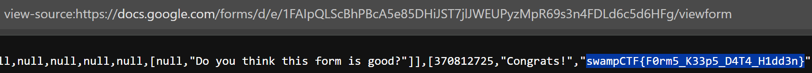
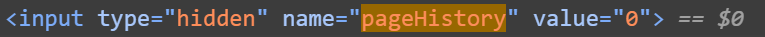
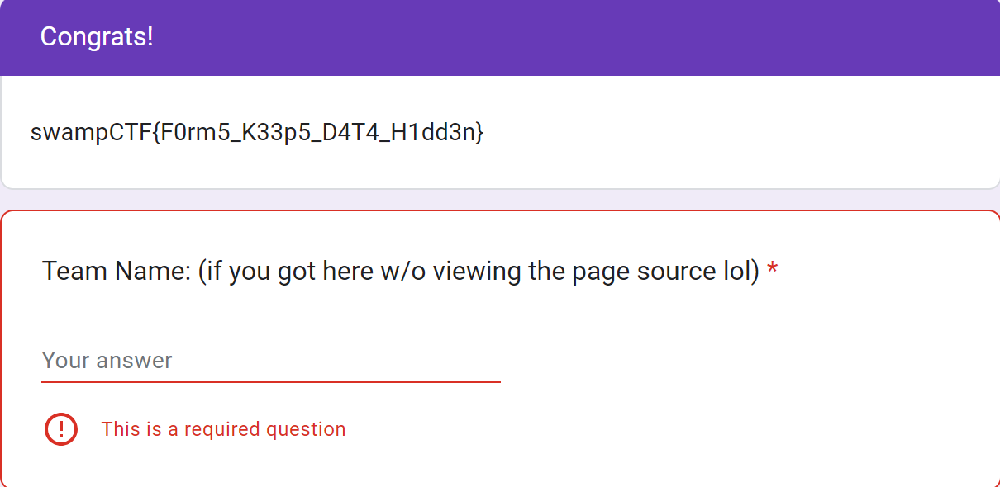

# Solution 1.

The easiest way is to view page source using your web browser.

1. Open the form in a browser that supports viewing the page source.
2. View the page source.
3. If you know the wrapper, you can search the source for it, otherwise you can manually look through the whole source to find the flag. 

# Solution 2.
This allows the user to submit the form and see the Flag. It also can allow users to submit the form without answering the questions.

1. Open the form in a browser that supports Inspect Element.
2. You can utilize the built-in search function for "pageHistory", which will find a hidden variable.
3. Update this variable's value from 0 to 1. 

4. After updating the value, click next and you will reach the page with the flag.

5. It's possible to submit the form from here without answering the question.

> Note: The pageHistory variable increases each time you click the "next" or "back" buttons, so you will have to update the last value by 1 otherwise the solution will not work.
