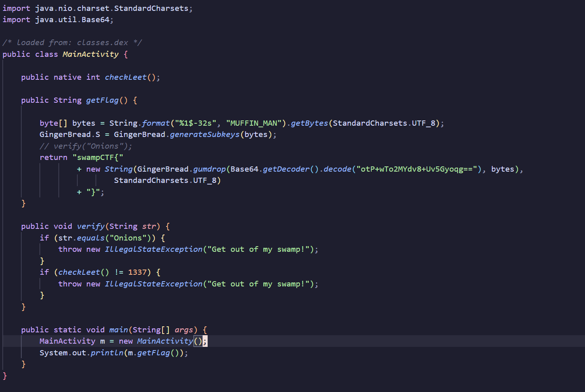

# Solution 1

1) Open the apk file in jadx
2) Create a Java project
3) Copy paste the main function and the gingerbread class 
4) Remove all android references 
5) Run it as you would normally in Java



# Solution 2 

Install the apk on an Android device or an Android emulator
> You can use this docker container: https://github.com/budtmo/docker-android


Push Frida Server to the Android device and run it
```bash
adb push frida-server-16.2.1-android-x86_64 /data/local/tmp

adb root
chmod +x /data/local/tmp/frida-server-16.2.1-android-x86_64
./frida-server-16.2.1-android-x86_64 -D &
```
Create a Frida script to hook the functions to change the arguments and return value
### Frida Script
```bash
frida -U -f <app-name> -l frida-scripts <script>
```
```js
// Function to hook java method
Java.perform(function () {
    var MainActivity = Java.use('com.rumpelstiltskin.anative.MainActivity');

    // Hook the method you want to modify the input parameters for
    MainActivity.verify.implementation = function (old_val) {
        console.log('Calling verify with modified parameters');
        // Call the original method with the modified parameters
        var result = this.leetVerify("ANYTHING BUT ONIONS");
        // Return the result
        return result;
    };

    // Print a message indicating hooking success
    console.log('Hooked java function');
  });


// Function to hook the native library function
function hookLibraryFunction() {
    // Replace with the actual library name and function to hook
    var targetLibrary = "libanative.so";
    var targetFunction = "Java_com_rumpelstiltskin_anative_MainActivity_checkLeet";

    // Wait for the library to be loaded
    var module = Module.findBaseAddress(targetLibrary);
    if (module) {
        // Find the address of the target function
        var targetFunctionAddress = Module.findExportByName(targetLibrary, targetFunction);

        if (targetFunctionAddress) {
            console.log("[+] Hooked native function at address: " + targetFunctionAddress);
            // Check if the function is not already intercepted
            Interceptor.attach(targetFunctionAddress, {
                onEnter: function (args) {
                    console.log("[+] Hooked " + targetFunction + ": Entered");
                },
                onLeave: function (retval) {
                    console.log("[+] Hooked " + targetFunction + ": Leaving");
                    // Modify the return value
                    console.log("[+] Modifying return value to 1337");
                    retval.replace(1337);
                }
            });
        } else {
            console.error("[-] Unable to find function address: " + targetFunction);
        }
    } else {
        console.error("[-] Unable to find base address for " + targetLibrary);
    }
}

// Attach Frida to the process
function attachToFrida() {
    setTimeout(hookLibraryFunction, 500); // Once the process has started, hook the library function
}

// Wait for the process to start before attaching Frida
setImmediate(attachToFrida);

```
> Note: This challenge can also be solved by patching out the smali instructions and removing the call to the 'verify' function.
